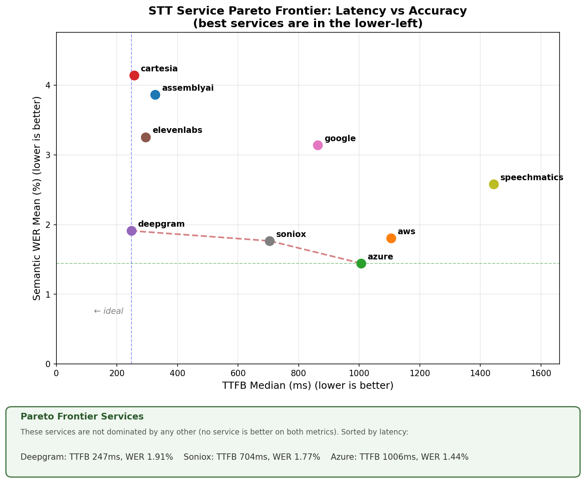
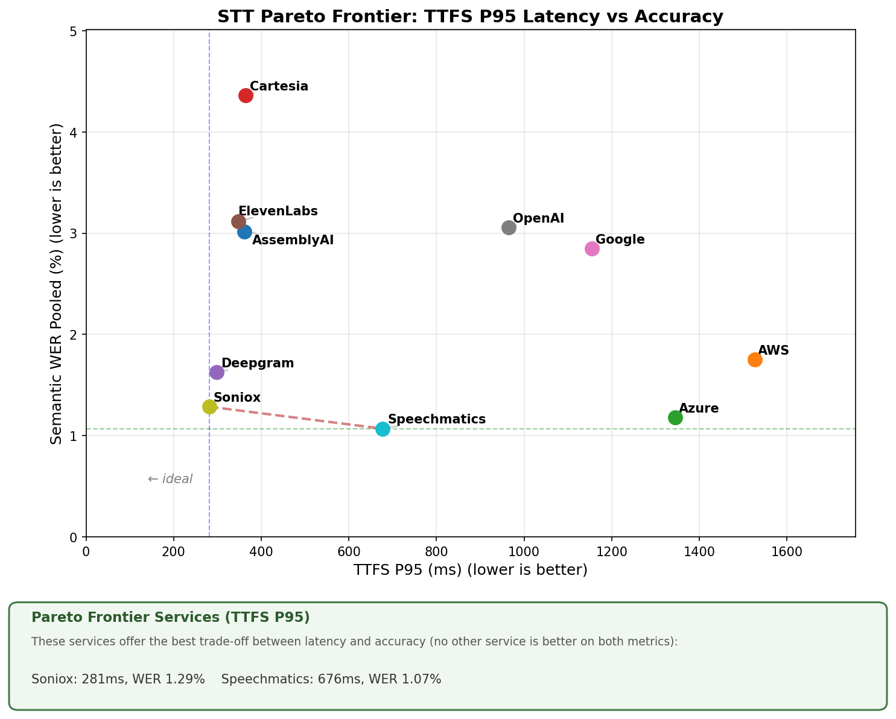

# STT Benchmark

A framework for benchmarking Speech-to-Text services with TTFS (Time To Final Segment) latency and Semantic WER (Word Error Rate) accuracy measurement.

## Results Summary

Benchmark results on 1000 samples from the `pipecat-ai/smart-turn-data-v3.1-train` dataset.

| Service | Transcripts | Perfect | WER Mean | Pooled WER | TTFS Median | TTFS P95 | TTFS P99 |
|---------|-------------|---------|----------|------------|-------------|----------|----------|
| assemblyai | 99.8% | 66.8% | 3.49% | 3.02% | 256ms | 362ms | 417ms |
| aws | 100.0% | 77.4% | 1.68% | 1.75% | 1136ms | 1527ms | 1897ms |
| azure | 100.0% | 82.9% | 1.21% | 1.18% | 1016ms | 1345ms | 1791ms |
| cartesia | 99.9% | 60.5% | 3.92% | 4.36% | 266ms | 364ms | 898ms |
| deepgram | 99.8% | 76.5% | 1.71% | 1.62% | 247ms | 298ms | 326ms |
| elevenlabs | 99.7% | 81.3% | 3.16% | 3.12% | 281ms | 348ms | 407ms |
| google | 100.0% | 69.0% | 2.84% | 2.85% | 878ms | 1155ms | 1570ms |
| openai | 99.3% | 75.9% | 3.24% | 3.06% | 637ms | 965ms | 1655ms |
| soniox | 99.8% | 84.1% | 1.25% | 1.29% | 249ms | 281ms | 310ms |
| speechmatics | 99.7% | 83.2% | 1.40% | 1.07% | 495ms | 676ms | 736ms |

### Latency vs Accuracy Trade-off

**Typical Latency (Median)**



**Worst-Case Latency (P95)**



The Pareto frontier shows services that offer the best trade-off between latency and accuracy—no other service is better on both metrics. Services on the frontier represent efficient choices depending on your priorities.

For production voice agents, **P95 latency matters more than median**. Even occasional high latency (5% of interactions) can break the conversational flow. A service with great median but poor P95 indicates inconsistent performance.

### Metrics Glossary

| Metric | Description |
|--------|-------------|
| **Transcripts** | Percentage of samples where STT successfully returned a transcription |
| **Perfect** | Perfect transcriptions (0% semantic WER) out of total benchmark runs |
| **WER Mean** | Average semantic word error rate across all samples |
| **Pooled WER** | Weighted WER (total errors / total reference words) |
| **TTFS Median** | Median time from user stops speaking to final transcription segment |
| **TTFS P95** | 95th percentile TTFS - worst 5% of samples have latency above this |
| **TTFS P99** | 99th percentile TTFS - worst 1% of samples have latency above this |

> **Semantic WER** measures only transcription errors that would impact an LLM agent's understanding. Punctuation, contractions, filler words, and equivalent phrasings are ignored.

> **TTFS (Time To Final Segment)** is measured from when the user stops speaking to when the final transcription segment is received. For streaming voice agents, lower TTFS means faster response times.

## Measure TTFS for Your Service

If you're using Pipecat and want TTFS latency numbers for your STT service and configuration, see **[Measuring TTFS](docs/measuring-ttfs.md)** for a quick start guide. The P95/P99 values from this tool can be used directly in Pipecat's `ttfs_p99_latency` service configuration (Pipecat 0.0.102+).

## Quick Start

```bash
# Install dependencies
uv sync

# Download audio samples
uv run stt-benchmark download --num-samples 100

# Run benchmarks
uv run stt-benchmark run --services deepgram,openai

# Generate ground truth (Gemini)
uv run stt-benchmark ground-truth

# Calculate semantic WER (Claude)
uv run stt-benchmark wer

# View results
uv run stt-benchmark report
```

## Installation

Requires Python 3.12+ and [uv](https://docs.astral.sh/uv/).

```bash
git clone <repo-url>
cd stt-benchmark
uv sync
```

## Environment Variables

Copy `env.example` to `.env` and set your API keys:

```bash
cp env.example .env
```

## How It Works

### TTFS Measurement

**TTFS for STT is different from typical request/response latency.** Since STT services receive continuous audio input, there's no discrete request to measure from. Instead, we measure from when the user **stops speaking** to when the **final transcription** arrives.

```
┌─────────────────────────────────────────────────────────────────────────────┐
│ VADUserStartedSpeaking              Actual speech    VADUserStopped         │
│        t=0                            ends           SpeakingFrame          │
│         │                              │                  │                 │
│         ▼                              ▼                  ▼                 │
│  ═══════╪══════════════════════════════╪══════════════════╪════             │
│         │      Audio streaming to STT  │   VAD stop_secs  │                 │
│         │                              │◄────────────────►│                 │
│         │                              │                  │                 │
│         │                              └──── TTFS ────────┼────────►        │
│         │                           speech_end_time       │     T3          │
│         │                                                 │  (final         │
│         │     T1              T2                          │ transcript)     │
│         │      │               │                          │                 │
│         │      ▼               ▼                          │                 │
│         │  transcript      transcript                     │                 │
└─────────────────────────────────────────────────────────────────────────────┘
```

**Key points:**
- `speech_end_time` = `VADUserStoppedSpeakingFrame` timestamp − VAD `stop_secs`
- TTFS = final `TranscriptionFrame` receipt time − `speech_end_time`
- Streaming services emit multiple partial transcripts; we use the **final** one

**Why the final transcript?** For LLM/TTS, there's a discrete input→output making latency measurement simple. For streaming STT, audio flows continuously and generates multiple `TranscriptionFrame`s. We can't know when the STT service finalized audio for intermediate transcripts, so we measure from the final one and use the VAD signal to determine when the user actually stopped speaking.

### Semantic WER

Traditional WER penalizes every word difference equally. "gonna" vs "going to" counts as 2 errors.

**Semantic WER** uses Claude to evaluate whether differences actually matter:

| Ignored (not errors) | Counted (errors) |
|---------------------|------------------|
| Punctuation, capitalization | Word substitutions that change meaning |
| Contractions ("don't" → "do not") | Nonsense/hallucinated words |
| Singular/plural ("license" → "licenses") | Missing words that change intent |
| Filler words ("um", "uh") | Wrong names, numbers, negations |
| Number formats ("3" → "three") | Factual errors |

This gives accuracy metrics that reflect real-world impact on downstream LLM applications.

## Supported Services

`assemblyai`, `aws`, `azure`, `cartesia`, `deepgram`, `deepgram_flux`, `elevenlabs`, `fal`, `gladia`, `google`, `gradium`, `groq`, `hathora`, `nvidia`, `openai`, `sambanova`, `sarvam`, `soniox`, `speechmatics`, `whisper`

See `env.example` for required API keys.

## CLI Commands

### Running Benchmarks

```bash
# Benchmark specific services
uv run stt-benchmark run --services deepgram,openai

# Benchmark all configured services
uv run stt-benchmark run --services all

# Limit samples and adjust VAD
uv run stt-benchmark run --services deepgram --limit 50 --vad-stop-secs 0.3
```

### Generating Ground Truth

```bash
# Generate ground truth for all samples
uv run stt-benchmark ground-truth

# Interactive review with audio playback
uv run stt-benchmark ground-truth review <run_id>
```

### Calculating Semantic WER

```bash
# Calculate for all services
uv run stt-benchmark wer

# Force recalculate
uv run stt-benchmark wer --services deepgram --force-recalculate
```

### Viewing Reports

```bash
# Compare all services
uv run stt-benchmark report

# Detailed report for one service
uv run stt-benchmark report --service deepgram

# Show worst samples
uv run stt-benchmark report --service deepgram --errors 10
```

See [docs/cli.md](docs/cli.md) for complete CLI reference.

## Output Structure

```
stt_benchmark_data/
├── audio/                    # Downloaded audio files
├── results.db                # SQLite database
├── ground_truth_runs/        # Iteration JSONL files
├── validation_summary.txt    # Generated reports
└── validation_full.csv
```

### Database Tables

| Table | Description |
|-------|-------------|
| `samples` | Audio sample metadata |
| `benchmark_results` | TTFS and transcription results |
| `ground_truths` | Reference transcriptions (Gemini) |
| `wer_metrics` | Semantic WER calculations |
| `semantic_wer_traces` | Full Claude reasoning traces |

## Architecture

```
┌──────────────────────────────────────────────────────────┐
│                        PipelineTask                      │
│  observers=[MetricsCollector, TranscriptionCollector]    │
├──────────────────────────────────────────────────────────┤
│                                                          │
│       ┌──────────────────┐    ┌───────────────┐          │
│       │ SyntheticInput   │───▶│  STTService   │          │
│       │ Transport        │    │               │          │
│       │                  │    │ Emits:        │          │
│       │ - Plays audio    │    │ - Transcript  │          │
│       │ - Silero VAD     │    │ - MetricsFrame│          │
│       │ - Real-time pace │    │   (TTFS)      │          │
│       └──────────────────┘    └───────────────┘          │
│                                     │                    │
│                           Observers capture frames       │
└──────────────────────────────────────────────────────────┘
```

## Documentation

- [CLI Reference](docs/cli.md) - Complete command documentation
- [Running Analysis](docs/analysis.md) - Step-by-step analysis guide

## License

MIT
