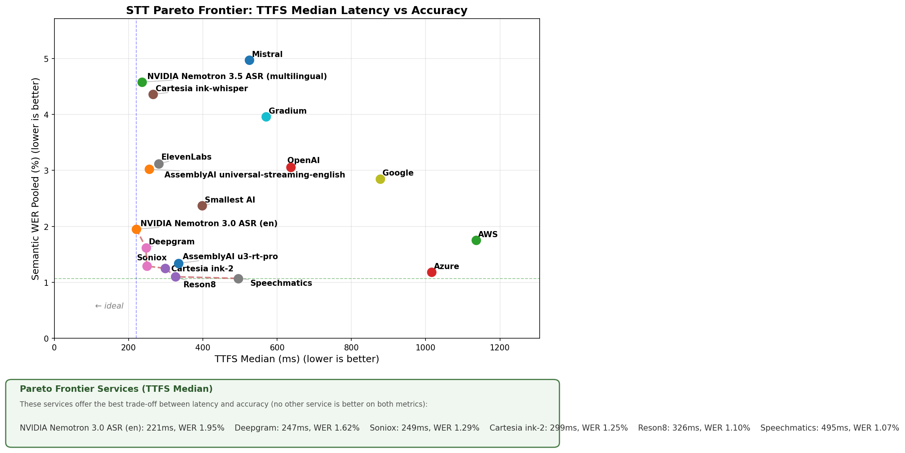
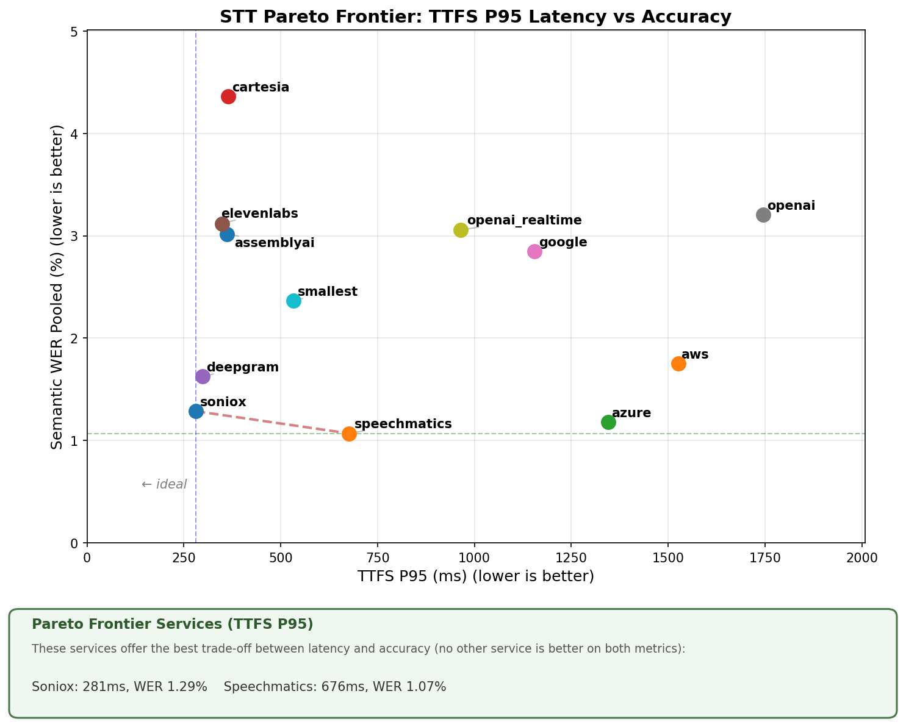

# Measuring our (Aiphoria) STT — in-house quickstart

> Local fork of pipecat-ai/stt-benchmark, extended with our deploy stack. This
> top section is the in-house guide for benchmarking **our** ASR; the upstream
> docs follow below.

## What "ours" means here

"Ours" covers **two families** of registered services — both defined in
`src/stt_benchmark/services.py` and registered in `src/stt_benchmark/models.py`.
All report TTFS on the same shared clock, so they're directly comparable.

**A. Direct asr-backend path** — our own ASR stack (Triton `asr-en-ensemble` +
`asr-backend-service` gRPC v2, model `hf/aiphoria_english_asr_v2_160ms` CTC):

| service name | setup | what it measures |
|---|---|---|
| `asr_backend` | 1a | our ASR + our **native in-Triton VAD-EOU** (`max_silence_ms=640`); final on backend `is_final` with `eou_reason` organic/repeating. **True product latency.** |
| `asr_backend_exteou` | 1b | our ASR + the **shared external `eou.py`** (640 ms rule), finalization decided client-side. Read the **1a − 1b gap** as our in-Triton/gRPC EOU overhead. |

**B. Production speech-proxy path** — ASR reached **through our** staging
speech-proxy (same platform_proto v2 gRPC API). This is the real production
integration path. The client is `SpeechProxyService`
(`services_aiphoria/speech_proxy.py`); pass the server-side recognizer via
`--recognizer`. The proxy finalizes on the **first** `is_final` with non-empty
text (`eou_reason`-agnostic):

| service name | setup | what it measures |
|---|---|---|
| `speech_proxy` | 4 | ASR via speech-proxy; recognizer chosen at CLI (default `asr_deepgram_en_nova3`). ⚠️ aggressive VAD recognizers can truncate long turns / fire before the anchor → those turns become *unmeasurable* (see caveat below). |

(For contrast the harness also has the **non-ours** direct-Deepgram-cloud setups
`deepgram` (2), `deepgram_native` (2b), `deepgram_exteou` (3) — those need
`DEEPGRAM_API_KEY`.)

Metric = TTFS (pipecat TTFB instrumentation): final `TranscriptionFrame` receipt
− (Silero VAD stop − `--vad-stop-secs`, default 0.2 s). A final that fires
*before* that anchor is unmeasurable, so premature endpointing shows up as a
*missing* sample, not a fast one. Results go to `stt_benchmark_data/results.db`
(or `test_results.db` with `--test`). Sample selection (dataset
`pipecat-ai/smart-turn-data-v3.1-train`, seed 42) lives in
`src/stt_benchmark/config.py` (env prefix `STT_BENCHMARK_`, `.env`), **not** as
`run` flags; concurrency is 1.

## Setup

Run all commands from the repo root. The harness uses [uv](https://docs.astral.sh/uv/)
(Python 3.13 per `pyproject.toml`).

```bash
git clone <repo-url>
cd stt-benchmark
uv sync
```

1. **Install dependencies** — `uv sync` pulls Pipecat, `platform-proto` (private
   git dep — SSH access to `ToolsAiforia/platform-proto` required), and the rest.
   No API keys are needed for `asr_backend` or `speech_proxy`.
2. **Download benchmark audio** — once, into `stt_benchmark_data/audio/`:
   ```bash
   uv run stt-benchmark download --num-samples 100
   ```
3. **Reach the target** — the benchmark is only a gRPC **client**. Ensure VPN /
   network access to the endpoint you pass on the CLI:
   - *asr_backend / asr_backend_exteou* → `--asr-backend-url` (default
     `localhost:50052`), `--no-asr-backend-use-ssl` (default), `--language en`.
     For local dev, `asr-backend-service` (fronting Triton) must already be
     running. **No API key.**
   - *speech_proxy* → `--speech-proxy-url` (default
     `speech-proxy.main.stage.aiphoria.pro:443`), `--speech-proxy-use-ssl`
     (default), `--recognizer` (default `asr_deepgram_en_nova3`). The proxy
     resolves recognizers server-side — the **client needs no `DEEPGRAM_API_KEY`**.

   Optional `.env` / `STT_BENCHMARK_*` overrides for paths and dataset size; see
   `env.example` and `src/stt_benchmark/config.py`.

## Debug mode (single sample)

`stt-benchmark debug` runs **one** utterance through the same Pipecat pipeline
as `run` (`SyntheticInputTransport` → Silero VAD → STT) and prints a stderr
timeline: audio chunks, VAD start/stop, interim/final ASR, and TTFB. **No DB
writes.** Exactly one service (`--services`), exactly one audio source
(`--file`, `--sample-id`, or `--sample-index`).

```bash
# List samples in the results DB
uv run stt-benchmark debug --list-samples

# Benchmark sample from main DB (index 0)
uv run stt-benchmark debug --services asr_backend --sample-index 0

# asr_backend against production
uv run stt-benchmark debug --services asr_backend \
  --asr-backend-url asr.prod.overtime.ai:443 --asr-backend-use-ssl \
  --language en --chunk-ms 260 --sample-index 0

# speech_proxy — custom wav (see scripts/runs/run_debug.sh)
uv run stt-benchmark debug --services speech_proxy \
  --speech-proxy-url speech-proxy.main.stage.aiphoria.pro:443 \
  --speech-proxy-use-ssl --recognizer asr_deepgram_flux_en \
  --chunk-ms 100 --test --file /path/to/your/sample.wav

# speech_proxy — benchmark sample from test DB
uv run stt-benchmark debug --services speech_proxy \
  --recognizer asr_deepgram_en_nova3_vad_v2 --sample-index 0 --test
```

Debug accepts the same gRPC / tuning flags as `run`: `--chunk-ms` (default 20 ms),
`--vad-stop-secs`, `--asr-backend-url`, `--asr-backend-use-ssl`, `--language`,
`--speech-proxy-url`, `--speech-proxy-use-ssl`, `--recognizer`, `--test`.

For **raw gRPC** tracing without the VAD pipeline, use
[`scripts/direct_stream_to_service.py`](scripts/direct_stream_to_service.py).

Reference launcher: [`scripts/runs/run_debug.sh`](scripts/runs/run_debug.sh).

## Full benchmark runs

Use `stt-benchmark run` for batch TTFS measurement. Workflow:

1. **Smoke test** — `--test --limit 2` writes to `test_results.db` (safe to iterate).
2. **Full run** — `--limit 100 --no-skip-existing` (add `--test` to keep results in
   `test_results.db`, or omit it to write to `results.db`). The launchers in
   `scripts/runs/run_speech_proxy_test.sh` use `--test` so prod/staging sweeps don't
   touch the main DB.
3. **Tag the run** — `--model` stores a label in the DB so you can compare configs
   in `report`.

Common tuning for our stack: `--chunk-ms 260` (matches production frame size).

### A. Direct asr-backend

```bash
# Smoke (local default)
uv run stt-benchmark run --services asr_backend --limit 2 --test

# Production ASR backend
uv run stt-benchmark run --services asr_backend \
  --asr-backend-url asr.prod.overtime.ai:443 --asr-backend-use-ssl \
  --language en --chunk-ms 260 --test --limit 100 --no-skip-existing \
  --model prod_overtime_asr_backend_en_2026_06_13

# Compare native in-Triton EOU vs external EOU (1a vs 1b)
uv run stt-benchmark run --services asr_backend,asr_backend_exteou \
  --limit 100 --no-skip-existing
```

Reference launcher: [`scripts/runs/run_asr_backend_test.sh`](scripts/runs/run_asr_backend_test.sh).

### B. Production speech-proxy

```bash
# Smoke (staging default URL + recognizer)
uv run stt-benchmark run --services speech_proxy \
  --recognizer asr_deepgram_en_nova3_vad_v2 --limit 2 --test

# Production speech-proxy — Aiphoria recognizer
uv run stt-benchmark run --services speech_proxy \
  --speech-proxy-url speech-proxy.prod.overtime.ai:443 --speech-proxy-use-ssl \
  --recognizer aiphoria__en --chunk-ms 260 --test --limit 100 \
  --no-skip-existing \
  --model prod_overtime_speech_proxy_aiphoria_en_2026_06_13

# Staging — Deepgram nova3 VAD v2
uv run stt-benchmark run --services speech_proxy \
  --speech-proxy-url speech-proxy.main.stage.aiphoria.pro:443 \
  --speech-proxy-use-ssl --recognizer asr_deepgram_en_nova3_vad_v2 \
  --chunk-ms 260 --test --limit 100 --no-skip-existing \
  --model main_stage_speech_proxy_deepgram_en_nova3_vad_v2_2026_06_13

# Staging — Deepgram Flux
uv run stt-benchmark run --services speech_proxy \
  --speech-proxy-url speech-proxy.main.stage.aiphoria.pro:443 \
  --speech-proxy-use-ssl --recognizer asr_deepgram_flux_en \
  --chunk-ms 260 --test --limit 100 --no-skip-existing \
  --model main_stage_speech_proxy_deepgram_flux_en_2026_06_13

# Local proxy dev (no TLS)
uv run stt-benchmark run --services speech_proxy \
  --speech-proxy-url localhost:50053 --no-speech-proxy-use-ssl \
  --recognizer asr_deepgram_en_nova3 --limit 2 --test
```

Reference launchers: [`scripts/runs/run_speech_proxy_test.sh`](scripts/runs/run_speech_proxy_test.sh)
(copied commands above).

### Reporting

```bash
uv run stt-benchmark report                  # all services in results.db
uv run stt-benchmark report --test           # test_results.db
uv run stt-benchmark report --service speech_proxy
```

Pareto plots: [`scripts/README.md`](scripts/README.md) (`pareto-frontier-plot.py`).

## CLI flags (run + debug)

Defined in `src/stt_benchmark/cli/benchmark.py` and `cli/debug.py`:

| Flag | Default | Notes |
|------|---------|-------|
| `--services/-s` | `all` (run only) | Comma-separated; debug requires exactly one |
| `--limit/-n` | all samples | run only |
| `--model/-m` | service default | Label stored in DB |
| `--skip-existing/--no-skip-existing` | skip | Use `--no-skip-existing` to re-measure |
| `--vad-stop-secs/-v` | 0.2 | Speech-end anchor offset |
| `--chunk-ms` | 20 | Input frame size (ms) |
| `--asr-backend-url` | `localhost:50052` | |
| `--asr-backend-use-ssl` | off | |
| `--language` | `en` | asr_backend only |
| `--speech-proxy-url` | staging host:443 | |
| `--speech-proxy-use-ssl` | on | |
| `--recognizer` | `asr_deepgram_en_nova3` | speech_proxy only |
| `--test/-t` | off | Use `test_results.db` instead of `results.db` |

Other commands: `download`, `report`, `ground-truth`, `wer`, `export`. Service
names are registered in `src/stt_benchmark/models.py`.

> ⚠️ **Validity caveat for aggressive VAD recognizers** (e.g.
> `asr_deepgram_en_nova3_vad_v2`). Their aggressive VAD often endpoints before
> the Silero speech-end anchor and/or truncates long turns, so a raw TTFS
> percentile over the DB is misleading. Use debug mode to inspect individual
> samples, and gate on transcript completeness before reading latency percentiles.

> **Convention:** keep repeatable launchers under `scripts/runs/` (see
> `run_speech_proxy_test.sh`, `run_asr_backend_test.sh`, `run_debug.sh`) and give
> each production run a distinct `--model` name.

---

# STT Benchmark

A framework for benchmarking Speech-to-Text services with TTFS (Time To Final Segment) latency and Semantic WER (Word Error Rate) accuracy measurement.

## Results Summary

Benchmark results on 1000 samples from the `pipecat-ai/smart-turn-data-v3.1-train` dataset.

| Service | Transcripts | Perfect | WER Mean | Pooled WER | TTFS Median | TTFS P95 | TTFS P99 |
|---------|-------------|---------|----------|------------|-------------|----------|----------|
| AssemblyAI | 99.8% | 66.8% | 3.49% | 3.02% | 256ms | 362ms | 417ms |
| AWS | 100.0% | 77.4% | 1.68% | 1.75% | 1136ms | 1527ms | 1897ms |
| Azure | 100.0% | 82.9% | 1.21% | 1.18% | 1016ms | 1345ms | 1791ms |
| Cartesia | 99.9% | 60.5% | 3.92% | 4.36% | 266ms | 364ms | 898ms |
| Deepgram | 99.8% | 76.5% | 1.71% | 1.62% | 247ms | 298ms | 326ms |
| Elevenlabs | 99.7% | 81.3% | 3.16% | 3.12% | 281ms | 348ms | 407ms |
| Google | 100.0% | 69.0% | 2.84% | 2.85% | 878ms | 1155ms | 1570ms |
| Mistral | 99.3% | 68.8% | 4.44% | 4.97% | 525ms | 973ms | 1913ms |
| OpenAI | 99.3% | 75.9% | 3.24% | 3.06% | 637ms | 965ms | 1655ms |
| Smallest AI | 100.0% | 72.4% | 2.30% | 2.37% | 398ms | 533ms | 1593ms |
| Soniox | 99.8% | 84.1% | 1.25% | 1.29% | 249ms | 281ms | 310ms |
| Speechmatics | 99.7% | 83.2% | 1.40% | 1.07% | 495ms | 676ms | 736ms |

### Latency vs Accuracy Trade-off

**Typical Latency (Median)**



**Worst-Case Latency (P95)**



The Pareto frontier shows services that offer the best trade-off between latency and accuracy—no other service is better on both metrics. Services on the frontier represent efficient choices depending on your priorities.

For production voice agents, **P95 latency matters more than median**. Even occasional high latency (5% of interactions) can break the conversational flow. A service with great median but poor P95 indicates inconsistent performance.

### Metrics Glossary

| Metric | Description |
|--------|-------------|
| **Transcripts** | Percentage of samples where STT successfully returned a transcription |
| **Perfect** | Perfect transcriptions (0% semantic WER) out of total benchmark runs |
| **WER Mean** | Average semantic word error rate across all samples |
| **Pooled WER** | Weighted WER (total errors / total reference words) |
| **TTFS Median** | Median time from user stops speaking to final transcription segment |
| **TTFS P95** | 95th percentile TTFS - worst 5% of samples have latency above this |
| **TTFS P99** | 99th percentile TTFS - worst 1% of samples have latency above this |

> **Semantic WER** measures only transcription errors that would impact an LLM agent's understanding. Punctuation, contractions, filler words, and equivalent phrasings are ignored.

> **TTFS (Time To Final Segment)** is measured from when the user stops speaking to when the final transcription segment is received. For streaming voice agents, lower TTFS means faster response times.

## Measure TTFS for Your Service

If you're using Pipecat and want TTFS latency numbers for your STT service and configuration, see **[Measuring TTFS](docs/measuring-ttfs.md)** for a quick start guide. The P95/P99 values from this tool can be used directly in Pipecat's `ttfs_p99_latency` service configuration (Pipecat 0.0.102+).

## Quick Start

```bash
# Install dependencies
uv sync

# Download audio samples
uv run stt-benchmark download --num-samples 100

# Run benchmarks
uv run stt-benchmark run --services deepgram,openai

# Generate ground truth (Gemini)
uv run stt-benchmark ground-truth

# Calculate semantic WER (Claude)
uv run stt-benchmark wer

# View results
uv run stt-benchmark report
```

## Installation

Requires Python 3.13+ and [uv](https://docs.astral.sh/uv/).

```bash
git clone <repo-url>
cd stt-benchmark
uv sync
```

## Environment Variables

Copy `env.example` to `.env` and set your API keys:

```bash
cp env.example .env
```

## How It Works

### TTFS Measurement

**TTFS for STT is different from typical request/response latency.** Since STT services receive continuous audio input, there's no discrete request to measure from. Instead, we measure from when the user **stops speaking** to when the **final transcription** arrives.

```
┌─────────────────────────────────────────────────────────────────────────────┐
│ VADUserStartedSpeaking              Actual speech    VADUserStopped         │
│        t=0                            ends           SpeakingFrame          │
│         │                              │                  │                 │
│         ▼                              ▼                  ▼                 │
│  ═══════╪══════════════════════════════╪══════════════════╪════             │
│         │      Audio streaming to STT  │   VAD stop_secs  │                 │
│         │                              │◄────────────────►│                 │
│         │                              │                  │                 │
│         │                              └──── TTFS ────────┼────────►        │
│         │                           speech_end_time       │     T3          │
│         │                                                 │  (final         │
│         │     T1              T2                          │ transcript)     │
│         │      │               │                          │                 │
│         │      ▼               ▼                          │                 │
│         │  transcript      transcript                     │                 │
└─────────────────────────────────────────────────────────────────────────────┘
```

**Key points:**
- `speech_end_time` = `VADUserStoppedSpeakingFrame` timestamp − VAD `stop_secs`
- TTFS = final `TranscriptionFrame` receipt time − `speech_end_time`
- Streaming services emit multiple partial transcripts; we use the **final** one

**Why the final transcript?** For LLM/TTS, there's a discrete input→output making latency measurement simple. For streaming STT, audio flows continuously and generates multiple `TranscriptionFrame`s. We can't know when the STT service finalized audio for intermediate transcripts, so we measure from the final one and use the VAD signal to determine when the user actually stopped speaking.

### Semantic WER

Traditional WER penalizes every word difference equally. "gonna" vs "going to" counts as 2 errors.

**Semantic WER** uses Claude to evaluate whether differences actually matter:

| Ignored (not errors) | Counted (errors) |
|---------------------|------------------|
| Punctuation, capitalization | Word substitutions that change meaning |
| Contractions ("don't" → "do not") | Nonsense/hallucinated words |
| Singular/plural ("license" → "licenses") | Missing words that change intent |
| Filler words ("um", "uh") | Wrong names, numbers, negations |
| Number formats ("3" → "three") | Factual errors |

This gives accuracy metrics that reflect real-world impact on downstream LLM applications.

## Supported Services

`assemblyai`, `aws`, `azure`, `cartesia`, `deepgram`, `deepgram_flux`, `elevenlabs`, `fal`, `gladia`, `google`, `gradium`, `groq`, `nvidia`, `nvidia_sagemaker`, `openai`, `sarvam`, `smallest`, `soniox`, `speechmatics`, `whisper`

See `env.example` for required API keys.

## CLI Commands

### Running Benchmarks

```bash
# Benchmark specific services
uv run stt-benchmark run --services deepgram,openai

# Benchmark all configured services
uv run stt-benchmark run --services all

# Limit samples and adjust VAD
uv run stt-benchmark run --services deepgram --limit 50 --vad-stop-secs 0.3
```

### Generating Ground Truth

```bash
# Generate ground truth for all samples
uv run stt-benchmark ground-truth

# Interactive review with audio playback
uv run stt-benchmark ground-truth review <run_id>
```

### Calculating Semantic WER

```bash
# Calculate for all services
uv run stt-benchmark wer

# Force recalculate
uv run stt-benchmark wer --services deepgram --force-recalculate
```

### Viewing Reports

```bash
# Compare all services
uv run stt-benchmark report

# Detailed report for one service
uv run stt-benchmark report --service deepgram

# Show worst samples
uv run stt-benchmark report --service deepgram --errors 10
```

See [docs/cli.md](docs/cli.md) for complete CLI reference.

## Output Structure

```
stt_benchmark_data/
├── audio/                    # Downloaded audio files
├── results.db                # SQLite database (main runs)
├── test_results.db           # Separate DB when using --test
├── ground_truth_runs/        # Iteration JSONL files
├── validation_summary.txt    # Generated reports
└── validation_full.csv
```

### Database Tables

| Table | Description |
|-------|-------------|
| `samples` | Audio sample metadata |
| `benchmark_results` | TTFS and transcription results |
| `ground_truths` | Reference transcriptions (Gemini) |
| `wer_metrics` | Semantic WER calculations |
| `semantic_wer_traces` | Full Claude reasoning traces |

## Architecture

```
┌──────────────────────────────────────────────────────────┐
│                        PipelineTask                      │
│  observers=[MetricsCollector, TranscriptionCollector]    │
├──────────────────────────────────────────────────────────┤
│                                                          │
│       ┌──────────────────┐                               │
│       │ SyntheticInput   │  Plays audio at real-time pace│
│       │ Transport        │                               │
│       └────────┬─────────┘                               │
│                ▼                                         │
│       ┌──────────────────┐                               │
│       │ VADProcessor     │  Emits VAD frames via Silero  │
│       └────────┬─────────┘                               │
│                ▼                                         │
│       ┌──────────────────┐                               │
│       │ STTService       │  Emits transcript + metrics   │
│       └──────────────────┘                               │
│                           Observers capture frames       │
└──────────────────────────────────────────────────────────┘
```

## Dataset

The benchmark dataset (audio samples and ground truth transcriptions) is publicly available on Hugging Face:

**[pipecat-ai/stt-benchmark-data](https://huggingface.co/datasets/pipecat-ai/stt-benchmark-data)**

Audio samples are sourced from the `pipecat-ai/smart-turn-data-v3.1-train` dataset. Ground truth transcriptions are generated with Gemini and human-reviewed.

## Documentation

- [CLI Reference](docs/cli.md) - Complete command documentation
- [Running Analysis](docs/analysis.md) - Step-by-step analysis guide

## License

MIT
